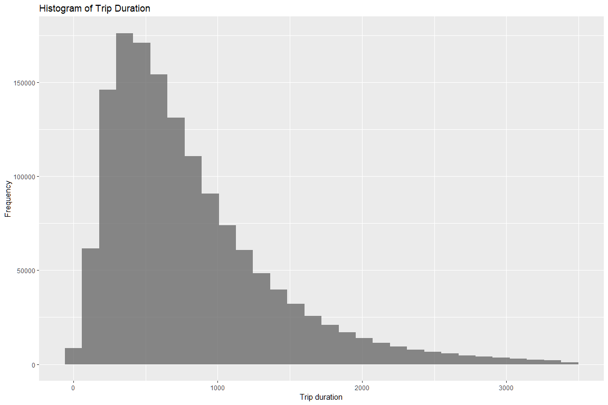
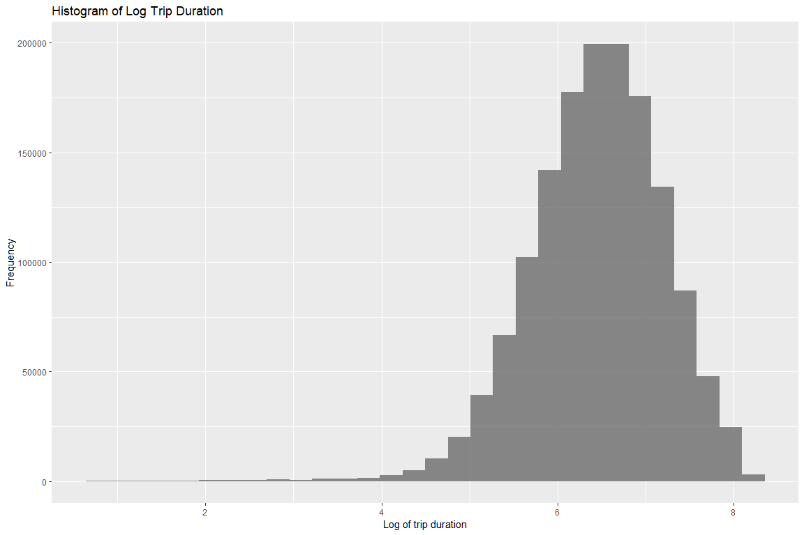
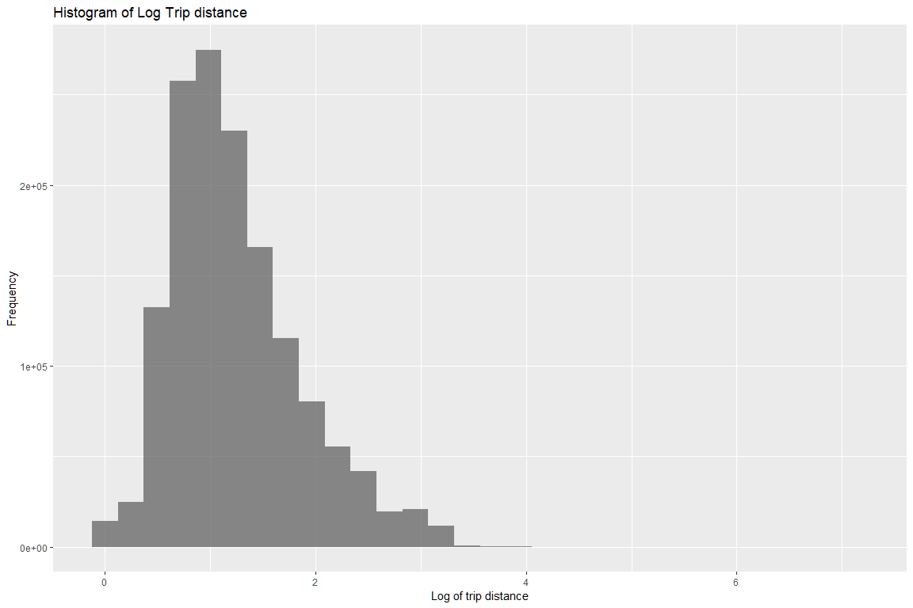
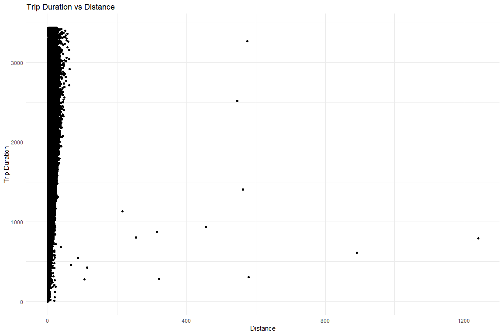

NYC Taxi Trip Duration Challenge
================================

The task at hand is to predict taxi trip durations in NYC using
variables such as pickup time, geo-coordinates, number of passengers,
etc.

Data Import
-----------

Let’s read in the training and testing data files. We will use the
stringsAsFactors FALSE since we don’t want all the strings to be
converted to factor variables as some of the date columns would be
stored as characters too.

``` r
test <- read.csv('test.csv', header = TRUE, stringsAsFactors = FALSE)
train <- read.csv('train.csv', header = TRUE, stringsAsFactors = FALSE)
```

What do the datasets look like?
-------------------------------

    ## [1] "The structure of the training data is shown below - "

    ## Observations: 1,458,644
    ## Variables: 11
    ## $ id                 <chr> "id2875421", "id2377394", "id3858529", "id3...
    ## $ vendor_id          <int> 2, 1, 2, 2, 2, 2, 1, 2, 1, 2, 2, 2, 2, 2, 2...
    ## $ pickup_datetime    <chr> "2016-03-14 17:24:55", "2016-06-12 00:43:35...
    ## $ dropoff_datetime   <chr> "2016-03-14 17:32:30", "2016-06-12 00:54:38...
    ## $ passenger_count    <int> 1, 1, 1, 1, 1, 6, 4, 1, 1, 1, 1, 4, 2, 1, 1...
    ## $ pickup_longitude   <dbl> -73.98215, -73.98042, -73.97903, -74.01004,...
    ## $ pickup_latitude    <dbl> 40.76794, 40.73856, 40.76394, 40.71997, 40....
    ## $ dropoff_longitude  <dbl> -73.96463, -73.99948, -74.00533, -74.01227,...
    ## $ dropoff_latitude   <dbl> 40.76560, 40.73115, 40.71009, 40.70672, 40....
    ## $ store_and_fwd_flag <chr> "N", "N", "N", "N", "N", "N", "N", "N", "N"...
    ## $ trip_duration      <int> 455, 663, 2124, 429, 435, 443, 341, 1551, 2...

<br> <br>

    ## [1] "The structure of the test data is shown below - "

    ## Observations: 625,134
    ## Variables: 9
    ## $ id                 <chr> "id3004672", "id3505355", "id1217141", "id2...
    ## $ vendor_id          <int> 1, 1, 1, 2, 1, 1, 1, 1, 2, 2, 1, 2, 1, 2, 1...
    ## $ pickup_datetime    <chr> "2016-06-30 23:59:58", "2016-06-30 23:59:53...
    ## $ passenger_count    <int> 1, 1, 1, 1, 1, 1, 1, 2, 2, 1, 4, 1, 1, 1, 1...
    ## $ pickup_longitude   <dbl> -73.98813, -73.96420, -73.99744, -73.95607,...
    ## $ pickup_latitude    <dbl> 40.73203, 40.67999, 40.73758, 40.77190, 40....
    ## $ dropoff_longitude  <dbl> -73.99017, -73.95981, -73.98616, -73.98643,...
    ## $ dropoff_latitude   <dbl> 40.75668, 40.65540, 40.72952, 40.73047, 40....
    ## $ store_and_fwd_flag <chr> "N", "N", "N", "N", "N", "N", "N", "N", "N"...

We see that we have a LOT of training and testing data - around
1,458,644 observations in the training data and 625,134 observations in
the test data. We note that in both the datasets, the datetime columns
`pickup_datetime` and `dropoff_datetime` have been imported as character
variables. These will need to be properly encoded. Two variables present
in the train data are not present in the test data - these are
`dropoff_datetime` and the output variable `trip_duration`. <br>

Let’s add these variables with the value 0 in the test data for
consistency.

``` r
test$dropoff_datetime <- 0 # add dropoff_datetime
test$trip_duration <- 0 # add trip_duration
```

Missing values
--------------

-   Missing values in the training data.

<!-- -->

    ##                 id          vendor_id    pickup_datetime 
    ##                  0                  0                  0 
    ##   dropoff_datetime    passenger_count   pickup_longitude 
    ##                  0                  0                  0 
    ##    pickup_latitude  dropoff_longitude   dropoff_latitude 
    ##                  0                  0                  0 
    ## store_and_fwd_flag      trip_duration 
    ##                  0                  0

<br>

-   Missing values in the test data.

<!-- -->

    ##                 id          vendor_id    pickup_datetime 
    ##                  0                  0                  0 
    ##    passenger_count   pickup_longitude    pickup_latitude 
    ##                  0                  0                  0 
    ##  dropoff_longitude   dropoff_latitude store_and_fwd_flag 
    ##                  0                  0                  0 
    ##   dropoff_datetime      trip_duration 
    ##                  0                  0

We find that these datasets do not have missing values. Good!

Data Exploration
----------------

Let’s look at a few rows of data and gather what we have.

    ##          id vendor_id     pickup_datetime    dropoff_datetime
    ## 1 id2875421         2 2016-03-14 17:24:55 2016-03-14 17:32:30
    ## 2 id2377394         1 2016-06-12 00:43:35 2016-06-12 00:54:38
    ## 3 id3858529         2 2016-01-19 11:35:24 2016-01-19 12:10:48
    ## 4 id3504673         2 2016-04-06 19:32:31 2016-04-06 19:39:40
    ## 5 id2181028         2 2016-03-26 13:30:55 2016-03-26 13:38:10
    ##   passenger_count pickup_longitude pickup_latitude dropoff_longitude
    ## 1               1        -73.98215        40.76794         -73.96463
    ## 2               1        -73.98042        40.73856         -73.99948
    ## 3               1        -73.97903        40.76394         -74.00533
    ## 4               1        -74.01004        40.71997         -74.01227
    ## 5               1        -73.97305        40.79321         -73.97292
    ##   dropoff_latitude store_and_fwd_flag trip_duration
    ## 1         40.76560                  N           455
    ## 2         40.73115                  N           663
    ## 3         40.71009                  N          2124
    ## 4         40.70672                  N           429
    ## 5         40.78252                  N           435

We see that we have the following variables - <br>

-   `id` - Trip ID. This wont be useful for the purpose of prediction.
-   `pickup_datetime`, `dropoff_datetime` - Time for pickup and dropoff
    of passengers.
-   `passenger_count` - count of passengers in the vehicle. Larger
    number of passengers may highlight a cab sharing arrangement and
    could be indicative of larger trip times.
-   `pickup_longitude`, `pickup_latitude` - location of the pickup.
-   `dropoff_longitude`, `dropoff_latitude` - location of the drop.
-   `trip_duration` - duration of the cab ride in seconds.

Let’s look at some of the variables in more detail - <br>

-   `trip_duration`

``` r
summary(train$trip_duration)
```

    ##    Min. 1st Qu.  Median    Mean 3rd Qu.    Max. 
    ##       1     397     662     959    1075 3526282

A summary above shows that while the 3rd quartile of `trip_duration` is
1075 seconds, we have a maximum of 3526282 seconds which is 980 hours!
This is impossible! The 99th percentile of the data is around 3440. We
will consider all the values above this to be outliers.

``` r
train <- train %>% filter(trip_duration <= quantile(train$trip_duration, 0.99))
```

We are left with 1444069 rows in the resulting dataset. These are still
enough datapoints for an efficient analysis. <br>

-   `pickup_datetime`, `dropoff_datetime`

Next let’s convert to datetime the date/time variables that are
currently encoded as character.

``` r
train <- train %>% mutate(dropoff_datetime = ymd_hms(dropoff_datetime, tz = Sys.timezone()),
                          pickup_datetime = ymd_hms(pickup_datetime, tz = Sys.timezone()))
```

    ## Warning: 1 failed to parse.

    ## Warning: 1 failed to parse.

``` r
train <- na.exclude(train)

test <- test %>% mutate(pickup_datetime = ymd_hms(pickup_datetime, tz = Sys.timezone()))
```

Feature Engineering
-------------------

### Distance using latitude and longitude values.

We are given the latitude and longitude for the pickup and dropoff
locations. Let’s use these to calculate the distances between the pickup
and dropoff points. This will aid analysis as longer distances would
generally take a longer time.

``` r
# function to convert degrees to radians
deg2rad <- function(x) {return(x*pi/180)}

# calculate distances from lat-lon combinations

train <- train %>% mutate(
  dropoff_latitude_rad = deg2rad(dropoff_latitude),
  dropoff_longitude_rad = deg2rad(dropoff_longitude),
  pickup_latitude_rad = deg2rad(pickup_latitude),
  pickup_longitude_rad = deg2rad(pickup_longitude),
  dlon = dropoff_longitude_rad - pickup_longitude_rad,
  dlat = dropoff_latitude_rad - pickup_latitude_rad,
  a = (sin(dlat/2))^2 + cos(pickup_latitude_rad) * cos(dropoff_latitude_rad) * (sin(dlon/2))^2,
  c = 2 * atan2(sqrt(a), sqrt(1-a)),
  distance = c * 6373)

# remove unnecessary variables
train <- train %>% select(-c(dlon, dlat,a,c))

test <- test %>% mutate(
  dropoff_latitude_rad = deg2rad(dropoff_latitude),
  dropoff_longitude_rad = deg2rad(dropoff_longitude),
  pickup_latitude_rad = deg2rad(pickup_latitude),
  pickup_longitude_rad = deg2rad(pickup_longitude),
  dlon = dropoff_longitude_rad - pickup_longitude_rad,
  dlat = dropoff_latitude_rad - pickup_latitude_rad,
  a = (sin(dlat/2))^2 + cos(pickup_latitude_rad) * cos(dropoff_latitude_rad) * (sin(dlon/2))^2,
  c = 2 * atan2(sqrt(a), sqrt(1-a)),
  distance = c * 6373)

test <- test %>% select(-c(dlon, dlat,a,c))
```

### Day of the week when pickup happens.

we have data from 1st January 2016 to 30th June 2016. Let’s get the
weekdays corresponding to the dates. This matters because traffic
conditions vary in an area based on day of the week as well as time of
the day. These in turn affect the times taken to complete a trip.

``` r
train$Pickup_Day_Name <- weekdays(train$pickup_datetime)

test$Pickup_Day_Name <- weekdays(test$pickup_datetime)
```

### Identifier for weekdays and weekends.

Weekdays and weekends have different traffic patterns. Let’s create an
identifier for this.

``` r
train <- train %>% 
  mutate(Weekday_YN = case_when(Pickup_Day_Name %in% c("Saturday","Sunday") ~ 0,
                                TRUE ~ 1))

test <- test %>% 
  mutate(Weekday_YN = case_when(Pickup_Day_Name %in% c("Saturday","Sunday") ~ 0,
                                TRUE ~ 1))
```

### Rush hour identifier

Weekday rush hours are expected to get more traffic and higher trip
durations. Rush hours are usually from 8-10am and 6-9 pm. Expected rush
hours on weekends in the evening 6 to 9pm when people usually start
going out!

``` r
train <- train %>% 
  mutate(Rush_Hour = ifelse(Weekday_YN == 1 & 
                              hour(pickup_datetime)>17 & 
                              hour(pickup_datetime)<22,1, 
                            ifelse(Weekday_YN == 1 & 
                                     hour(pickup_datetime)>7 & 
                                     hour(pickup_datetime)<11,1,
                                   ifelse(Weekday_YN == 0 & 
                                            hour(pickup_datetime)>17 & 
                                            hour(pickup_datetime)<22, 1, 0))))

test <- test %>% 
  mutate(Rush_Hour = ifelse(Weekday_YN == 1 & 
                              hour(pickup_datetime)>17 & 
                              hour(pickup_datetime)<22,1,
                            ifelse(Weekday_YN == 1 & 
                                     hour(pickup_datetime)>7 & 
                                     hour(pickup_datetime)<11,1,
                                   ifelse(Weekday_YN == 0 & 
                                            hour(pickup_datetime)>17 &
                                            hour(pickup_datetime)<22, 1, 0))))
```

### Add identifiers for major holidays.

Holidays will see unusual traffic too. We will add a binary variable to
identify major holidays in NYC between 1st January 2016 to 30th June
2016.

``` r
holidays <- as.Date(c("2016-01-01", "2016-01-18", "2016-02-12", "2016-02-15",
                      "2016-05-08", "2016-05-30", "2016-06-19"))

train <- train %>% 
  mutate(Holiday_YN = case_when(as.Date(pickup_datetime) %in% holidays ~ 1,
                                TRUE ~ 0))

test <- test %>% 
  mutate(Holiday_YN = case_when(as.Date(pickup_datetime) %in% holidays ~ 1,
                                               TRUE ~ 0))
```

### Time of the day

Traffic is less early mornings and late nights, while it is heavy in the
morning and early evening. Therefore, capturing time as a categorical
variable with the aforementioned levels should help in predicting the
time taken for a ride to complete.

``` r
train <- train %>% 
  mutate(Time_of_Day = ifelse(hour(pickup_datetime) >= 0 & 
                                hour(pickup_datetime) < 6,"Early Morning",
                              ifelse(hour(pickup_datetime) >= 6 & 
                                       hour(pickup_datetime) < 12,"Morning",
                                     ifelse(hour(pickup_datetime) >= 12 & 
                                              hour(pickup_datetime) < 18, "Afternoon", 
                                            "Night"))))

test <- test %>% 
  mutate(Time_of_Day = ifelse(hour(pickup_datetime) >= 0 & 
                                hour(pickup_datetime) < 6,"Early Morning",
                              ifelse(hour(pickup_datetime) >= 6 & 
                                       hour(pickup_datetime) < 12,"Morning",
                                     ifelse(hour(pickup_datetime) >= 12 &
                                              hour(pickup_datetime) < 18, "Afternoon", 
                                            "Night"))))
```

### Frequency of pickups and dropoffs at locations.

If there are a large number of pickups and dropoffs at a location, then
the ride times are bound to be on the higher side.

``` r
pickup_dropff_locations <- rbind(train[,c("pickup_longitude","pickup_latitude",
                                          "dropoff_longitude", "dropoff_latitude")], 
                                 test[,c("pickup_longitude","pickup_latitude",
                                         "dropoff_longitude", "dropoff_latitude")])

pickup_frequency <- pickup_dropff_locations %>% 
  group_by(pickup_longitude, pickup_latitude) %>% 
  dplyr::summarise(Pickup_Address_Frequency = n()) %>%
  arrange(desc(Pickup_Address_Frequency))

dropoff_frequency <- pickup_dropff_locations %>% 
  group_by(dropoff_longitude, dropoff_latitude) %>% 
  dplyr::summarise(Dropoff_Address_Frequency = n()) %>%
  arrange(desc(Dropoff_Address_Frequency))

train2 <- left_join(train, pickup_frequency, by = c("pickup_longitude" = "pickup_longitude", "pickup_latitude" = "pickup_latitude"))

train3 <- left_join(train2, dropoff_frequency, by = c("dropoff_longitude" = "dropoff_longitude", "dropoff_latitude" = "dropoff_latitude"))

test2 <- left_join(test, pickup_frequency, by = c("pickup_longitude" = "pickup_longitude", "pickup_latitude" = "pickup_latitude"))

test3 <- left_join(test2, dropoff_frequency, by = c("dropoff_longitude" = "dropoff_longitude", "dropoff_latitude" = "dropoff_latitude"))
```

### Log Transform the trip duration and distance variables

The `distance` and `trip_duration` variables have a skewed distribution.
Let’s use a log transform to bring the distributions closer to normal.

``` r
ggplot(train) +
  geom_histogram(mapping = aes(x = trip_duration), alpha = 0.7) +
  labs(x = "Trip duration",
       y = "Frequency",
       title = "Histogram of Trip Duration")
```

    ## `stat_bin()` using `bins = 30`. Pick better value with `binwidth`.



``` r
# add log transform of trip duration variable and distance variable
train <- train %>% mutate(logtrip_duration = log1p(trip_duration))
train <- train %>% mutate(log_distance = log1p(distance))
test <- test %>% mutate(log_distance = log1p(distance))
```

We see below that the log transformed variables have a distribution
closer to normal than the original variables.

``` r
ggplot(train) +
  geom_histogram(mapping = aes(x = logtrip_duration), alpha = 0.7) +
  labs(x = "Log of trip duration",
       y = "Frequency",
       title = "Histogram of Log Trip Duration")
```

    ## `stat_bin()` using `bins = 30`. Pick better value with `binwidth`.



``` r
ggplot(train) +
  geom_histogram(mapping = aes(x = log_distance), alpha = 0.7) +
  labs(x = "Log of trip distance",
       y = "Frequency",
       title = "Histogram of Log Trip distance")
```

    ## `stat_bin()` using `bins = 30`. Pick better value with `binwidth`.



### Distance 0 means ride cancellation.

Lets build a variable that captures the fact. This would help the model
keep trip durations small when the distance is very small or 0.

``` r
train <- train %>% mutate(CancelYN = ifelse(log_distance == 0,1,0))
test <- test %>% mutate(CancelYN = ifelse(log_distance == 0,1,0))
```

### Convert categorical variables to factors.

``` r
train <- train %>% mutate(vendor_id = as.factor(vendor_id),
                          store_and_fwd_flag = as.factor(store_and_fwd_flag),
                          Pickup_Day_Name = as.factor(Pickup_Day_Name),
                          Time_of_Day = as.factor(Time_of_Day))

test <- test %>% mutate(vendor_id = as.factor(vendor_id),
                        store_and_fwd_flag = as.factor(store_and_fwd_flag),
                        Pickup_Day_Name = as.factor(Pickup_Day_Name),
                        Time_of_Day = as.factor(Time_of_Day))
```

### Plot of trip distance with duration.

Can we get a sense of average speed of the vehicle between destinations?

``` r
ggplot(data = train, mapping = aes(x = distance, y = trip_duration))+
  geom_point()+
  theme_minimal() +
  labs(
    x = "Distance",
    y = "Trip Duration",
    title = "Trip Duration vs Distance"
  )
```



We see many outliers here with very large distance but trip durations
very less.Let’s calculate speed to get an estimate of the outliers.

``` r
train <- train %>% mutate(Vehicle_Speed = distance*3600/trip_duration)

outliers1 <- which(train$Vehicle_Speed > 100)
outliers2 <- which(train$Vehicle_Speed < 1)

# correcting the dataset
train <- train[-outliers1,]
train <- train[-outliers2,]
```

Modelling
---------

``` r
train.modelling <- train[,c("vendor_id", "passenger_count", "store_and_fwd_flag",
                            "logtrip_duration", "Pickup_Day_Name", "log_distance", 
                            "Weekday_YN", "Rush_Hour", "Holiday_YN","Time_of_Day",
                            "Pickup_Address_Frequency", "Dropoff_Address_Frequency",
                            "CancelYN")]

## Check basic model performance
model1 <- lm(logtrip_duration ~ ., data = train.modelling)
summary(model1)
```

    ## 
    ## Call:
    ## lm(formula = logtrip_duration ~ ., data = train.modelling)
    ## 
    ## Residuals:
    ##     Min      1Q  Median      3Q     Max 
    ## -4.7276 -0.2657  0.0154  0.2829  3.0975 
    ## 
    ## Coefficients: (1 not defined because of singularities)
    ##                             Estimate Std. Error  t value Pr(>|t|)    
    ## (Intercept)                5.3842752  0.0018147 2967.020  < 2e-16 ***
    ## vendor_id2                 0.0037231  0.0008264    4.505 6.64e-06 ***
    ## passenger_count            0.0069474  0.0003128   22.212  < 2e-16 ***
    ## store_and_fwd_flagY       -0.0350587  0.0053839   -6.512 7.43e-11 ***
    ## Pickup_Day_NameMonday     -0.1086296  0.0014908  -72.867  < 2e-16 ***
    ## Pickup_Day_NameSaturday   -0.0536444  0.0014346  -37.394  < 2e-16 ***
    ## Pickup_Day_NameSunday     -0.1472028  0.0014849  -99.134  < 2e-16 ***
    ## Pickup_Day_NameThursday    0.0136251  0.0014330    9.508  < 2e-16 ***
    ## Pickup_Day_NameTuesday    -0.0198803  0.0014628  -13.590  < 2e-16 ***
    ## Pickup_Day_NameWednesday   0.0052053  0.0014495    3.591 0.000329 ***
    ## log_distance               0.9737753  0.0006622 1470.430  < 2e-16 ***
    ## Weekday_YN                        NA         NA       NA       NA    
    ## Rush_Hour                  0.1694849  0.0010922  155.174  < 2e-16 ***
    ## Holiday_YN                -0.0638919  0.0021745  -29.382  < 2e-16 ***
    ## Time_of_DayEarly Morning  -0.3615801  0.0013775 -262.491  < 2e-16 ***
    ## Time_of_DayMorning        -0.1821556  0.0011783 -154.594  < 2e-16 ***
    ## Time_of_DayNight          -0.2795449  0.0012510 -223.463  < 2e-16 ***
    ## Pickup_Address_Frequency  -0.0090626  0.0005102  -17.763  < 2e-16 ***
    ## Dropoff_Address_Frequency  0.0163816  0.0008901   18.405  < 2e-16 ***
    ## CancelYN                  -0.0444695  0.0062520   -7.113 1.14e-12 ***
    ## ---
    ## Signif. codes:  0 '***' 0.001 '**' 0.01 '*' 0.05 '.' 0.1 ' ' 1
    ## 
    ## Residual standard error: 0.4705 on 1432870 degrees of freedom
    ## Multiple R-squared:  0.6136, Adjusted R-squared:  0.6136 
    ## F-statistic: 1.264e+05 on 18 and 1432870 DF,  p-value: < 2.2e-16

### GBM Model

Let’s see how a boosted regression model performs on the data.

``` r
gbm_model <- gbm(logtrip_duration ~., data =train.modelling,
                 shrinkage = 0.05,
                 interaction.depth = 5,
                 bag.fraction = 0.66,
                 n.minobsinnode = 1,
                 cv.folds = 3,
                 keep.data = F,
                 verbose = F,
                 n.trees = 300)
```

    ## Distribution not specified, assuming gaussian ...

``` r
prediction.gbm <- predict(object = gbm_model, newdata = test, n.trees = 300)
prediction.gbm <- exp(prediction.gbm) - 1

result <- cbind(test, trip_duration = prediction.gbm)
```

### Optimise gbm model.

Let’s now try to optimise the GBM model using the `caret` package.

``` r
gbmGrid <-  expand.grid(interaction.depth = 11,
                        n.trees = 200, 
                        shrinkage = 0.05,
                        n.minobsinnode = 1)

fitControl <- trainControl(method = "repeatedcv",
                           number = 3,
                           repeats = 1)

gbm_tuned_model <- train(logtrip_duration ~ ., data = train.modelling,
                         #distribution = "gaussian",
                         method = "gbm", 
                         bag.fraction = 0.66,
                         trControl = fitControl,
                         verbose = FALSE,
                         tuneGrid = gbmGrid)
```
